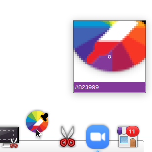

# picky

Color Picker docklet for Plank (elementary os dock)




## Dependencies

- vala
- gtk+-3.0
- libplank-dev

## Install

Clone this repository and cd in it

```
$ git clone github.com/hannenz/picky.git
$ cd picky
```

Make and install
```
$ make
$ sudo make install
```

Go to plank settings, choose "Docklets", find Picky and drag and drop
it into the plank

## Usage

Left click: Launch color picker

Mouse Wheel: Zoom in / out while picking

Right click: Open palette (10 recently picked colors), click on a
color to copy to clipboard
